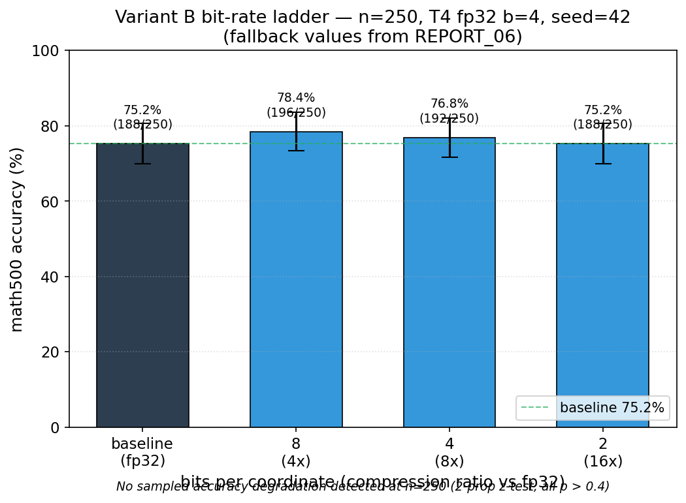

# Latent Space Compression Research — RecursiveLink × TurboQuant

Quantizing the inter-agent latent communication channel of [RecursiveMAS](https://github.com/RecursiveMAS/RecursiveMAS) Sequential-Light with the **MSE-optimal core of [TurboQuant](https://arxiv.org/abs/2504.19874)** (ICLR 2026) — a data-oblivious Haar rotation + Lloyd-Max quantizer, *without* the QJL inner-product residual. This repo labels that quantizer **Variant B**.

## TL;DR

**Variant B compresses the RecursiveMAS Sequential-Light inter-agent latent channel 4× to 16× with no measurable accuracy change under sampled decoding.**



Measured on math500, n=250, seed=42, **sampled** decoding, Kaggle T4 with `--dtype float32`. We do not detect an accuracy degradation for bit-rates {2, 4, 8} relative to the 75.2% baseline (two-proportion z-tests, all p > 0.4; 95% Wald intervals straddle zero); 2-bit reaches the same accuracy count as baseline (188/250) at 16× compression. ("No detected change" is not a proof of equality — see the caveat below.)

> ⚠️ **Honest caveat (don't read this as unconditional "lossless").** Under
> **greedy** decoding, paired accuracy intervals still allow effects of a few points,
> 4.4--10% of individual correctness outcomes change in the clean local cells, and
> 51.2--92.8% of primary sequences diverge within a 128-position capture window.
> The headline is an aggregate sampled-decoding statement, not bit-exact preservation.
> See [REPORT_08](docs/reports/08_local_cross_cell_generalization.md).

## Local cross-task and tier extension

A third backend reproduced the experiment on an RTX 5070 Ti (native bf16) and
extended it to four cells: Sequential-Light × {math500, MBPP+, MedQA} and
Sequential-Scaled × MBPP+. In the three clean math/code cells, paired greedy
accuracy deltas are small and non-significant, although 4.4--10% of individual
correctness outcomes change. MedQA greedy is excluded from that summary because its
weak unquantized REF develops a pathological first-option bias.

The corrected local trajectory analysis excludes conditional answer-retry calls and
is explicitly windowed to the first 128 decode positions. On the same MBPP+ task,
windowed divergence is **92.8% for Sequential-Light and 51.2% for
Sequential-Scaled**, at the same mean per-call channel cosine (0.9953). This is a
strong tier-associated robustness result, not yet a causal claim that parameter
count alone explains the difference. See [REPORT_08](docs/reports/08_local_cross_cell_generalization.md).

The powered greedy T=3 run measured ~1,152 latent token-vectors per math500 problem (all-link); at a representative channel dimension d≈2048 this is an **information-theoretic** reduction from ~9.0 MiB (fp32) to ~1.1 MiB (4-bit) / ~0.56 MiB (2-bit) per problem (a potential saving; we measure fake-quantization fidelity, not wall-clock bandwidth).

## Repository layout

```
.
├── README.md                ← you are here
├── docs/                    ← documentation (research design, reports, figures, plans)
├── src/                     ← Variant B quantizer + RecursiveLink patch infrastructure
├── tests/                   ← unit tests (run `python -m pytest tests/`)
├── experiments/             ← scripts to reproduce results (fidelity_sweep = Tier 2)
├── writeup/                 ← LaTeX write-up draft
├── requirements.txt         ← local env for tests + offline analysis
├── LICENSE                  ← All Rights Reserved (source-visible, not open-source)
└── bin/                     ← helper CLI wrappers
```

| Path | Read first |
|---|---|
| [docs/RESEARCH.md](docs/RESEARCH.md) | Master research design — hypotheses, method, current state |
| [docs/reports/06_variant_b_in_loop_HEADLINE.md](docs/reports/06_variant_b_in_loop_HEADLINE.md) | The main accuracy finding (n=250) |
| [docs/reports/07_fidelity_sweep_modal.md](docs/reports/07_fidelity_sweep_modal.md) | Tier 2 fidelity: channel + per-step KL vs depth, TOST |
| [docs/reports/08_local_cross_cell_generalization.md](docs/reports/08_local_cross_cell_generalization.md) | Local cross-task/tier results + corrected trajectory analysis |
| [docs/reports/05_hardware_root_cause.md](docs/reports/05_hardware_root_cause.md) | Why pre-Ampere GPUs collapse this pipeline |
| [REPRODUCIBILITY.md](REPRODUCIBILITY.md) | End-to-end external reproduction: run, fetch, verify, analyze |
| [experiments/README.md](experiments/README.md) | How to reproduce each result |
| [writeup/README.md](writeup/README.md) | Write-up + build instructions |
| [ROADMAP.md](ROADMAP.md) | Where the research goes next (future work) |

## Quick reproduction

The main result (Variant B bit-rate ladder at n=250) requires Kaggle T4 GPU (free tier). Setup:

```bash
# 1. Install Python deps
python -m venv .venv && source .venv/bin/activate
pip install -r requirements.txt     # numpy, scipy, matplotlib, torch, pytest
python -m pytest tests/             # current suite; reference-oracle tests may skip if absent

# 2. Configure Kaggle CLI credentials
#    (KAGGLE_USERNAME + KAGGLE_KEY env vars OR ~/.kaggle/kaggle.json)

# 3. Push the dataset (Variant B src/ as a Kaggle private dataset, one-time)
./bin/kaggle datasets create -p experiments/variant_b_ladder_t4_kaggle/dataset_pkg --dir-mode skip

# 4. Edit experiments/variant_b_ladder_t4_kaggle/kernel_pkg/kernel-metadata.json
#    to replace <YOUR_KAGGLE_USERNAME> with your username

# 5. Push and run the bit-rate ladder
./bin/push_kaggle_vb_kernel.sh 0 250 4   # baseline
./bin/push_kaggle_vb_kernel.sh 4 250 4   # Variant B 4-bit  (8× compression)
./bin/push_kaggle_vb_kernel.sh 2 250 4   # Variant B 2-bit  (16× compression)
```

Each kernel takes ~7-8 hours on Kaggle T4 fp32 b=4. Results download with
`./bin/kaggle kernels output ...`; verify and analyze them with:

```bash
.venv/bin/python bin/verify_artifacts.py /tmp/rmas_ladder_outputs \
    --manifest /tmp/rmas_ladder_outputs/SHA256SUMS.json

.venv/bin/python experiments/variant_b_ladder_t4_kaggle/analysis/analyze_ladder.py \
    --inputs /tmp/rmas_ladder_outputs \
    --n-samples 250 \
    --batch-size 4 \
    --out experiments/variant_b_ladder_t4_kaggle/analysis/results
```

For the full cloud run/fetch/analyze workflow, including Modal fidelity outputs
and checksum verification, use [REPRODUCIBILITY.md](REPRODUCIBILITY.md).

## What's NOT in this repo

- `external/RecursiveMAS/` — upstream code clone (4.8 MB). Get it with:
  `git clone https://github.com/RecursiveMAS/RecursiveMAS.git external/RecursiveMAS`
  then `git -C external/RecursiveMAS checkout f95d512017fb713e9ac519248fbfd3d270dafd68`.
- Cloud credentials (Kaggle API key, Modal token). Configure your own.
- Raw kernel output logs from past runs (~97 MB). The canonical numbers are in the markdown reports; re-running gets you fresh logs.
- 22 retracted Phase 0.B Kaggle P100 in-loop scripts. Findings preserved in [docs/reports/04_kaggle_p100_RETRACTED.md](docs/reports/04_kaggle_p100_RETRACTED.md).
- Intermediate failed/superseded experiments. Findings preserved in [docs/reports/05_hardware_root_cause.md](docs/reports/05_hardware_root_cause.md).

## Compute platforms used

- **Kaggle Tesla T4 16GB (free)** — accuracy ladder (REPORT_06). Requires `--dtype float32` explicit (T4 lacks native bf16 → silent collapse with auto dtype).
- **Modal A100 40GB (monthly free credit)** — baseline reproduction + the Tier 2 fidelity sweep (REPORT_07), fp32. The fidelity sweep is launched with `modal run experiments/fidelity_sweep/modal_pkg/fidelity_modal.py::sweep`.
- **Local RTX 5070 Ti 16GB** — native-bf16 replication and four-cell task/tier extension (REPORT_08).

## License

**All rights reserved** — see [LICENSE](LICENSE). This repository is made public
for transparency and reproducibility only; it is not open-source. Please do not
use, copy, modify, or redistribute any part of it without explicit written
permission. It builds on RecursiveMAS and TurboQuant, which carry their own
licenses.
