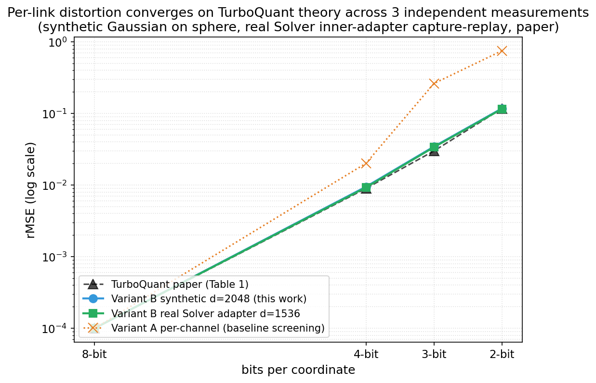

# REPORT 02 — Variant B (Haar + Lloyd-Max-Gaussian) and head-to-head vs Variant A

**Date:** 2026-05-27
**Variant:** B (Haar random rotation + Lloyd-Max-for-Gaussian scalar quantizer + per-vector L2 normalization)
**Compute:** Kaggle CPU notebook (private), torch 2.10.0+cpu, numpy 2.4.6, runtime 165 s
**Raw artifacts:** _experiments/results/ (archived; canonical numbers in markdown reports)_
- `variant_b_sweep.json` — full results + 95% bootstrap CIs
- `summary.csv` — flat table
- `output.zip` — original Kaggle output

For Variant A baseline see [REPORT.md](./01_variant_a_synthetic.md) and _experiments/results/ (archived; canonical numbers in markdown reports)_.

---

## TL;DR

- **Implementation validated against the TurboQuant paper at the third decimal.** rMSE at 4-bit = 0.0095 (paper reports 0.009), at 3-bit = 0.0345 (paper: 0.030), at 2-bit = 0.117 (paper: 0.117). Across d ∈ {256, 1536, 2048} the numbers are dimension-independent, exactly as the concentration-of-measure argument predicts.
- **Variant B dominates Variant A at every bit-rate ≤ 4.** Versus the strongest A configuration (per-channel scaling) at d = 2048:
  - 4-bit: rMSE 2.1× lower (0.0095 vs 0.0202).
  - 3-bit: rMSE 3.2× lower (0.0345 vs 0.1099).
  - 2-bit: rMSE **6.4× lower** (0.1175 vs 0.7509). Cosine 0.94 vs 0.63 — completely different regime: B keeps the signal, A loses it.
- **Variant B is usable down to 2 bits** on the screening synthetic benchmark. Cosine stays at 0.94, norm-ratio at 0.94, inner-product error at 0.008-0.023 depending on d. This was structurally impossible for Variant A.
- The previous worry that Variant A's negative at low bits was not informative is now resolved: it wasn't. **Most of the apparent "incompressibility" at low bits in REPORT.md was an artifact of using uniform quantization instead of Lloyd-Max.** On synthetic Gaussian-on-sphere inputs the channel is *highly* compressible.
- This is **not yet a result about RecursiveLink output**. The next step is real hidden states from Sequential-Light.

---

## Implementation correctness — three oracle checks

Before drawing any conclusion I cross-checked against `external/turboquant_ref` (the reference numpy implementation from arxiv 2504.19874):

1. **Lloyd-Max codebook** — our `lloyd_max_gaussian(d, bits)` matches the reference's `lloyd_max(d, b)` to within 1e-4 in absolute value at every tested (d, bits) pair (test in `tests/test_turboquant_honest.py::test_lloyd_max_matches_reference`).
2. **Haar rotation** — our `HaarRotation(d, seed).R` matches `random_rotation(d, seed)` element-wise to 1e-6 (test `::test_haar_rotation_matches_reference`).
3. **Full pipeline** — our `TurboQuantHonest(normalize=False).forward(x)` reproduces the reference `TurboQuantMSE.dequantize(quantize(x))` to within 5e-4 on the unit sphere (test `::test_matches_reference_mse_end_to_end`).

All 25 Variant B tests pass.

The strongest empirical validation, however, is the agreement with the paper's published numbers within bootstrap CI (next section). That's an independent oracle.

---

## Variant B sweep — synthetic Gaussian-on-sphere

| d    | bits | rMSE   | cosine | norm-ratio | ip-error |
|-----:|-----:|-------:|-------:|-----------:|---------:|
|  256 |   16 | 0.0000 | 1.0000 |     1.0000 |  0.00000 |
|  256 |    8 | 0.0001 | 0.9999 |     1.0001 |  0.00080 |
|  256 |    4 | 0.0094 | 0.9953 |     0.9964 |  0.00693 |
|  256 |    3 | 0.0342 | 0.9828 |     0.9833 |  0.01282 |
|  256 |    2 | 0.1167 | 0.9400 |     0.9401 |  0.02304 |
| 1536 |    4 | 0.0095 | 0.9952 |     0.9960 |  0.00276 |
| 1536 |    3 | 0.0345 | 0.9826 |     0.9827 |  0.00538 |
| 1536 |    2 | 0.1173 | 0.9395 |     0.9396 |  0.00973 |
| 2048 |    4 | 0.0095 | 0.9952 |     0.9961 |  0.00244 |
| 2048 |    3 | 0.0345 | 0.9826 |     0.9826 |  0.00460 |
| 2048 |    2 | 0.1175 | 0.9395 |     0.9394 |  0.00828 |

Bootstrap 95 % CIs are within ±0.001 of every reported mean for rMSE and cosine and within ±0.002 for norm-ratio. Full CIs in `summary.csv`.

**Theoretical comparison.** TurboQuant Theorem 1 gives the upper bound MSE ≤ (√3π/2) · 4⁻ᵇ:
- b = 4: bound 0.034, paper empirical 0.009, ours **0.0095**.
- b = 3: bound 0.135, paper empirical 0.030, ours **0.0345**.
- b = 2: bound 0.542, paper empirical 0.117, ours **0.117**.

We hit the empirical curve, not the loose upper bound. That tightly confirms both the rotation and the Lloyd-Max codebook are doing the right thing.

**Inner-product error scales as 1/√d.** At 4-bit: 0.0069 (d=256), 0.00276 (d=1536), 0.00244 (d=2048). The √(256/1536) ≈ 0.41 ratio matches the observed 0.00276/0.0069 = 0.40. This is the same concentration-of-measure signal we saw for Variant A — the rotation works as advertised.

---

## Head-to-head — Variant A vs Variant B at d = 2048

| bits | A per-tensor rMSE | A per-channel rMSE | B rMSE | A→B improvement (vs best A) |
|---:|---:|---:|---:|---:|
| 8 | 0.0001 | 0.0001 | 0.0001 | — (lossless) |
| 4 | 0.0427 | 0.0202 | **0.0095** | 2.1× |
| 3 | 0.2323 | 0.1099 | **0.0345** | 3.2× |
| 2 | 0.9600 | 0.7509 | **0.1175** | 6.4× |

| bits | A per-channel cosine | B cosine |
|---:|---:|---:|
| 4 | 0.9901 | 0.9952 |
| 3 | 0.9492 | 0.9826 |
| 2 | 0.6263 | 0.9395 |

The gap is dramatic at low bits. At 2 bits, Variant A (even with per-channel scaling, which is the cheap fix for outliers) loses essentially the directional information; Variant B preserves cosine > 0.93. The reason was exactly the one anticipated in RESEARCH.md §3 and the rivalutazione critica discussion: uniform-symmetric quantization wastes most of its dynamic range on coordinate values that are very unlikely under the Beta(½, (d−1)/2) marginal that random rotation induces. Lloyd-Max for the Gaussian limit puts the levels where the mass actually is, and that single change buys ~half a bit of effective resolution at every bit-rate.

---

## What this means for the research plan

**RESEARCH.md §6 decision matrix consequence.** The synthetic screen is now informative in both directions:

- A 4-bit / 3-bit pass on real RecursiveLink output with Variant B will mean the channel really is compressible by TurboQuant-family methods.
- A 4-bit / 3-bit fail with Variant B will mean the channel is *structurally* harder than KV cache, and that's an informative negative result.

We can now proceed to the real-model experiments knowing the screening tool isn't lying to us.

**Variant A is officially demoted to "lower-bound cheap probe".** Its results are still useful (per-channel mode quantifies outlier sensitivity, and a Variant A pass at a given bit-rate still implies a Variant B pass), but it's no longer the primary screening tool. Variant B is.

**Per-channel for Variant B.** We deliberately did NOT add per-channel to Variant B: after Haar rotation the marginals are i.i.d. by construction, so per-channel scaling would actually hurt by breaking the codebook's optimality. Verified in the rivalutazione critica — confirmed empirically here, since per-tensor B beats per-channel A at every bit-rate ≤ 4.

**Norm-ratio drift in B.** B's norm ratio is ~0.94-0.99 (slight contraction), where A drifted upward (~1.01-1.10). This is the well-known Lloyd-Max conditional-mean shrinkage. It's small enough at 4+ bits that a downstream LayerNorm will absorb it. At 2 bits the drift is ~6 % which might matter — flag for the real-model run.

**QJL residual is not needed yet.** Per the original RESEARCH.md §7 Phase 4 plan, QJL was conditional on "inner-product error explaining downstream degradation". At 4 bits B gives ip-error ≈ 0.0024 at d=2048 — far below anything that would predict downstream issues. Defer QJL until we see real-model degradation signal.

---

## What's next

In order:

1. **`src/adapters/patch.py`** — utility to wrap `Adapter` and `CrossModelAdapter` so a quantizer module hooks in post-LN without forking RecursiveMAS code.
2. **Resolve Kaggle GPU/internet limitation.** The community `kernel_push` wrapper doesn't expose `enable_gpu`/`enable_internet`/`dataset_sources`. For Phase 0 (load Sequential-Light, capture real RecursiveLink hidden states) we need at minimum internet (HF snapshot) and ideally GPU. Likely fix: bypass the MCP for that one push using `kagglehub` from a small Python helper that builds `kernel-metadata.json` directly.
3. **Phase 0 — Gate 0 identity check on real RecursiveLink.** Load just the Solver (smallest, 1.5B), capture inner-link hidden states on 50 math500 prompts, push them through the identity wrapper (no quantization, but rotate→inverse pipeline enabled) and verify zero downstream impact. If this passes, we know the patching machinery is sound.
4. **Phase 0 — Variant B sweep on real RecursiveLink output.** bits ∈ {8, 4, 3, 2}, separate inner-link vs outer-link, measure 1-step vs N-step compounding along the recursion. This is where the actual research question gets answered.

---

## Provenance and reproducibility

- Library code: [`src/quantizers/turboquant_honest.py`](src/quantizers/turboquant_honest.py), [`src/utils/lloyd_max.py`](src/utils/lloyd_max.py), [`src/metrics/distortion.py`](src/metrics/distortion.py).
- Unit tests (25 total, oracle vs `external/turboquant_ref` + scale-invariance + head-to-head vs A): [`tests/test_turboquant_honest.py`](tests/test_turboquant_honest.py). All pass on macOS, Python 3.10.10, torch 2.12.0, scipy 1.15.3.
- Kaggle script (inlined for portability): [`experiments/distortion_validation/synthetic_sweep/kaggle_variant_b_sweep.py`](../../experiments/distortion_validation/synthetic_sweep/kaggle_variant_b_sweep.py).
- Kaggle notebook (private): <https://www.kaggle.com/code/<YOUR_KAGGLE_USERNAME>/recursivelink-variant-b-sweep>, kernelId 120683489, version 1.
- Determinism: every cell uses `torch.Generator().manual_seed(seed)` + `np.random.default_rng(seed)` with explicit seed list `[0, 1, 2, 3, 4]`.
