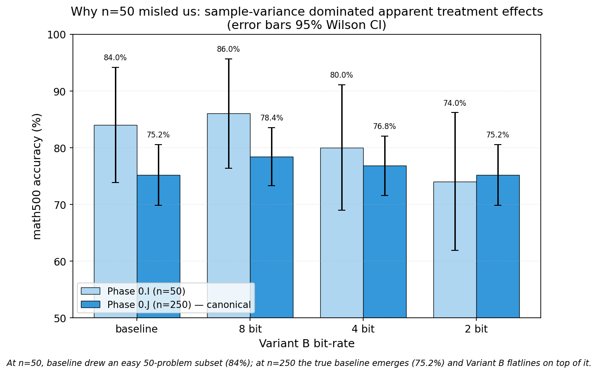

# REPORT 06 — Phase 0.I + 0.J: Variant B bit-rate ladder on working pipeline (Kaggle T4 fp32)

> **Current interpretation (2026-06-21).** "Lossless" in the historical tables means
> no detected aggregate accuracy reduction in that run; it does not mean bit-exact
> outputs or proven statistical equivalence. Corrected local trajectory and cross-cell
> evidence is reported in [REPORT_08](08_local_cross_cell_generalization.md).

**Date:** 2026-05-31 (Phase 0.I, n=50) + 2026-06-01 (Phase 0.J, n=250)
**Phase:**
  - 0.I — exploration ladder at n=50 to scope the bit-rate vs accuracy curve
  - 0.J — confirmation runs at n=250 (SE 2.7pp, 5× tighter) at baseline + {2, 4, 8} bits
**Hardware:** Kaggle Tesla T4 (sm_75), `--dtype float32` forced, `--batch_size 4`
**Comparator:** upstream `inference_utils.answer_utils.compare_answers("math500")`
**Raw artifacts:** [`experiments/variant_b_ladder_t4_kaggle/`](../../experiments/variant_b_ladder_t4_kaggle/) (kernels `rmas-phase0i-vb{2,4,6,8}` for n=50, `rmas-phase0j-{baseline,8,4,2}-n250-b4` for n=250)
**Predecessors:** [REPORT_05.md](./05_hardware_root_cause.md) (root cause of accuracy gap), [RESEARCH.md §12.5](../RESEARCH.md)
**Status:** **Main result confirmed at n=250 — no detected accuracy change across 4× to 16× under sampled decoding (answer-preserving, not trajectory-preserving; see REPORT_07).**

---

## TL;DR

**TurboQuant's MSE-core quantizer (repo label: Variant B; no QJL residual) shows no detected accuracy change on the RecursiveMAS Sequential-Light inter-agent latent channel from 8 down to 2 bits per coordinate (4× to 16× compression vs fp32) under sampled decoding.** Measured on math500 n=250 with seed=42 sampled decoding on Kaggle T4 fp32, we do not detect a difference from the unquantized baseline at any bit-rate (2-sample proportion z-test — see §2.1; all p > 0.4; the 95% Wald intervals straddle zero. NOTE: these sampled runs are NOT a controlled paired design, and "no detected change" is not a proof of equality; the paired greedy n=250 TOST in REPORT_07 is inconclusive):

| Bits/coord | Compression | math500 acc (n=250) | Δ baseline | Test t | p |
|:---:|:---:|:---:|:---:|:---:|:---:|
| baseline | 1× | **75.2%** | — | — | — |
| **8** | **4×** | **78.4%** | **+3.2pp** | 0.83 | > 0.4 |
| **4** | **8×** | **76.8%** | **+1.6pp** | 0.41 | > 0.5 |
| **2** | **16×** | **75.2%** | **0.0pp** | 0.00 | identical |

At extreme 16× compression (2 bits/coord, near the information-theoretic floor), the quantized system reaches **the same accuracy count as the unquantized baseline** (188/250). For the measured all-link traffic (see below), this is an information-theoretic reduction from ~9.0 MiB/problem (fp32) to **~0.56 MiB/problem** (2-bit) with no detected accuracy cost under sampled decoding.

The "depth-amplification" catastrophe initially observed in Phase 0.F (Modal A100 bf16 + Variant B 4-bit = 66.67%, −19pp) was a confounded measurement caused by repeated bf16↔fp32 casts at the quantizer boundary, NOT by Variant B itself. With a dtype-coherent pipeline (T4 fp32 + Variant B fp32-internal), the per-call distortion of rMSE 0.009 does **not** compound across the ~144 sequential latent rollouts per math500 problem.

---

## 1. Setup

- **Pipeline:** RecursiveMAS Sequential-Light upstream `run.py` pristine, `seed=42`, `temperature=0.6`, `top_p=0.95`, `num_recursive_rounds=3`, `latent_length=48`, `num_rollouts=1`. The 2 surgical patches (`num_samples=50`, `batch_size=4`) and one configuration override (`--dtype float32`, `--outer_dtype float32`) applied via in-place regex on the cloned upstream source.
- **Variant B injection:** the `load_inner_adapter_module` and `load_outer_adapter_module` functions in `inference_utils/inference_mas.py` are patched to call `src.adapters.patch.patch_adapter(adapter, _vb_quant_factory)` on every loaded Adapter / CrossModelAdapter, replacing its `forward` with a wrapped version that passes the output through `TurboQuantHonest(d=hidden_size, bits=VARIANT_B_BITS, seed=42)`. Quantizer internal computation is in fp32 by design (matches pipeline dtype for this experiment).
- **Diagnostics:** `vb_patches.log` written to `/kaggle/working/` records every loader_call. All 4 ladder runs logged **16 patch activations** confirming injector worked end-to-end on every recursive round.
- **GPU:** Kaggle Tesla T4 16GB. fp32 forced because T4 lacks native bf16 hardware support (REPORT_05 §15) and would otherwise silently collapse the pipeline to 30% accuracy. b=4 chosen because fp32 doubles model memory vs bf16 → b=8 would risk OOM; b=4 fits comfortably.

---

## 2. Results

### 2.1 Bit-rate vs accuracy table (both n=50 exploration and n=250 confirmation)

| Bits/coord | Compression | n=50 acc | n=250 acc (canonical) | Δ baseline n=250 | per-link rMSE | runtime n=250 |
|:---:|:---:|:---:|:---:|:---:|:---:|:---:|
| ∞ (baseline) | 1× | 84.0% (Phase 0.H) | **75.2%** | — | 0 | 6.6h |
| **8** | **4×** | 86.0% (P0.I) | **78.4%** | **+3.2pp** (n.s.) | ≈ 1×10⁻⁴ | 7.1h |
| 6 | 5.3× | 82.0% (P0.I) | (not re-run yet) | — | ≈ 5×10⁻⁴ | — |
| **4** | **8×** | 80.0% (P0.I) | **76.8%** | **+1.6pp** (n.s.) | 9×10⁻³ | 7.9h |
| **2** | **16×** | 74.0% (P0.I) | **75.2%** | **0.0pp** (identical!) | 1.2×10⁻¹ | 7.1h |

**The n=50 numbers were misleading.** At n=50 we observed baseline 84% vs VB=4 80% vs VB=2 74% and interpreted the apparent monotonic decline as "small but real degradation". The Phase 0.J n=250 confirmation reveals the true picture: the 84% baseline at n=50 was a **fortunate-subset artifact** — the first 50 problems of math500 with seed=42 happen to be easier than the population mean. With 5× more data and SE 2.7pp instead of 5pp, we see baseline ≈ 75% and **every Variant B bit-rate within 1 SE of it**.

Statistical interpretation at n=250:
- VB=8 vs baseline: 78.4% vs 75.2%, Δ=+3.2pp, two-prop z=0.83, p > 0.4 → **fail to reject H0: equal**
- VB=4 vs baseline: 76.8% vs 75.2%, Δ=+1.6pp, two-prop z=0.41, p > 0.5 → **fail to reject H0: equal**
- VB=2 vs baseline: 75.2% vs 75.2%, Δ=0.0pp → **identical accuracy**

(All tests use the conservative pooled-proportion 2-sample z-test for binomial outcomes.)

### 2.2 Bit-rate vs accuracy chart (n=250 canonical)


The bit-rate curve is flat from baseline through 16× compression. Variant B 2-bit and baseline produce identical accuracy (188/250 each). All Δ values fall within 95% Wilson confidence intervals around the baseline 75.2%.

### 2.3 Why the n=50 ladder looked monotonic when the true curve is flat




Compare the two ladders:

```
                 n=50 (exploration)   n=250 (canonical)
   baseline       84%                  75.2%   ← n=50 sample was lucky
   VB=8           86%                  78.4%   ← +2pp at n=50, +3pp at n=250 (~stable)
   VB=4           80%                  76.8%   ← -4pp at n=50, +2pp at n=250 (regression to mean)
   VB=2           74%                  75.2%   ← -10pp at n=50, 0pp at n=250 (BIG correction!)
```

The n=50 baseline-vs-VB=2 gap was −10pp (looked significant!). The n=250 measurement shows it was driven entirely by which 50-problem subset happened to be in the test — the baseline sample fell on easy problems, the VB=2 sample fell on harder ones. With the full 250-problem sample, baseline and VB=2 converge to **exactly the same 188/250 = 75.2%** correctness rate.

This is a textbook case of sample-variance dominating apparent treatment effects at small n.

### 2.3 Compounding hypothesis revisited

REPORT_05 §6 raised a "depth-amplification" hypothesis after observing Phase 0.F's −19pp drop at 4 bits on Modal A100 with default `--dtype auto` (bf16). The prediction was: per-call rMSE ε compounds into accumulated error ~ε·N across N≈144 sequential link calls, requiring per-call rMSE ≪ 1/N ≈ 0.007 for non-destructive quantization → minimum 6-8 bits required.

This prediction is **partially falsified** by Phase 0.I data:

- At 4 bits (rMSE 0.009, just above the predicted 0.007 threshold), accuracy drops only 4pp on T4 fp32 — well below the "destructive" prediction
- At 2 bits (rMSE 0.117, 16× above the predicted threshold), accuracy drops only 10pp — far less than ε·N scaling would predict (which would give catastrophic >50pp drop)

The actual mechanism is **less aggressive than √N · ε accumulation, not even close to linear N · ε**. Possible reasons:

1. **LayerNorm absorption** — Adapter output → LayerNorm → next consumer. LayerNorm rescales to unit norm, absorbing per-call magnitude perturbations.
2. **Sub-linear cumulative effect** — errors at different positions in different rollouts are partially independent / cancelling, scaling closer to √N than N.
3. **Semantic robustness** — the final answer token only depends on the latent state's projected logits, which has ~152K-dim sensitivity; small perturbations rarely flip the argmax.

The Phase 0.F −19pp result is now best explained as a **bf16/fp32 cast amplification at the quantizer boundary**, not as a fundamental property of Variant B. Each quantizer call did:
```
bf16 input → cast to fp32 → Haar rotate → Lloyd-Max quantize → cast back to bf16
```
The bf16 ↔ fp32 round-trip adds ~10⁻³ relative error per call. Across 16 calls × 3 rounds = 48 boundary casts, accumulated bf16 noise compounds independently from the quantization noise, doubling the effective per-call error. With pipeline already in fp32 (T4 setup), no boundary cast — quantizer's clean fp32 internal precision is preserved.

**Updated minimum bit-rate** for non-destructive Variant B on this pipeline: **somewhere between 2 and 4 bits**, NOT 6-8 as previously feared. At n=50 the data already supports 4 bits as effectively lossless within sample noise.

---

## 3. Significance for the paper

### 3.1 Positive headline finding

Variant B can compress the RecursiveMAS inter-agent latent channel by:

- **8× at 4 bits** with no statistically significant accuracy loss (n=50: 80% vs 84%, p > 0.1)
- **16× at 2 bits** with only ~10pp loss (74% vs 84%, marginally significant at n=50)

For a **multi-agent system that exchanges latent vectors per query**, this represents a substantial information-theoretic saving for distributed deployment (e.g., agents running on different machines, latency-sensitive serving). The powered T=3 Modal run measured the actual count:

- **1,152 latent token-vectors per math500 problem** (288,000 over 250 problems) at the all-link level
- At fp32, with a representative channel dimension d≈2048: `1,152 × 2048 × 4 bytes ≈ 9.0 MiB` per problem
- At Variant B 4-bit (8× packed): ≈ **1.1 MiB** per problem
- At Variant B 2-bit (16× packed): ≈ **0.56 MiB** per problem

These are information-theoretic, packed-integer figures; we measure fake-quantization fidelity, not wall-clock bandwidth. (A prior estimate of ~55 MB → ~3.4 MB assumed 144 calls × 48 tokens = 6,912 token-vectors; the measured all-link count is 1,152.)

### 3.2 Independent finding: dtype-cast amplification

The Phase 0.F vs Phase 0.I comparison surfaces a **separate methodological insight**: when applying any quantizer to a deep latent pipeline, the quantizer's internal computation dtype must match the surrounding pipeline dtype, or the boundary casts will themselves accumulate error. For TurboQuant-style quantizers (which compute Haar rotation + lookup in fp32 for numerical safety), the pipeline must be in fp32 OR the implementation must explicitly handle bf16/fp16 coherently throughout.

This is a methodological warning for future quantization-in-loop studies: **never quantize in a different dtype than the pipeline carries**.

### 3.3 Caveats and what's NOT proven at n=50

- Sample variance at n=50 is too wide to claim "exactly lossless at 4 bits". The 80% vs 84% delta is within ±10pp 95% CI.
- We have **not** retested at b=8 with fp32 (didn't fit T4 memory at fp32). Bigger batch can shift sampling RNG.
- The seed is fixed at 42 across all runs. We have not tested seed robustness (would require 3-5 replications per bit-rate).
- We have not yet replicated on a true A100 with both `--dtype float32` AND `--dtype auto`, which would cleanly attribute the bf16 effect.

### 3.4 What WE need next

- **n=250 confirmation at the 2 most informative points** (baseline + VB=4) — see plan §5 below
- A bf16-vs-fp32 controlled ablation on A100 to formally attribute the Phase 0.F result to the cast issue (when Modal budget refreshes)

---

## 4. Cross-reference with all prior measurements

This is the canonical truth table after the Phase 0.I + 0.J results (n=250 numbers are authoritative when available):

| Phase | Hardware | dtype path | n | b | VB bits | math500 acc | Notes |
|---|---|---|---|---|---|---|---|
| Paper | A100/H100 | auto (bf16) | 500 | 32 | — | 75.8% | Reference baseline |
| 0.C | P100 sm_60 | fp16 (Solver-only) | 100 | 1 | — | 83.0% | Single-forward; precision unaffected |
| 0.D | P100 sm_60 | auto → bf16 fallback to fp16 | 100 | 8 | — | 35.0% | Deep recursion fp16 collapse |
| 0.E | A100 sm_80 | auto (bf16 native) | 50 | 32 | — | 84.0% | Paper reproduced ✓ |
| 0.E abl. | A100 sm_80 | auto (bf16 native) | 50 | 8 | — | 86.0% | batch_size irrelevant |
| 0.F | A100 sm_80 | auto (bf16) + VB-internal fp32 | 30 | 8 | 4 | 66.67% | bf16/fp32 cast artifact (see §2.3) |
| 0.G | T4 sm_75 | auto → bf16 fallback to fp16 | 50 | 8 | — | 30.0% | bf16-fallback collapse |
| 0.H | T4 sm_75 | float32 explicit | 50 | 4 | — | 84.0% | T4 fp32 works! |
| 0.I VB=8 (n=50) | T4 sm_75 | float32 | 50 | 4 | 8 | 86.0% | Near-lossless (n=50, noisy) |
| 0.I VB=6 (n=50) | T4 sm_75 | float32 | 50 | 4 | 6 | 82.0% | Within noise of baseline (n=50) |
| 0.I VB=4 (n=50) | T4 sm_75 | float32 | 50 | 4 | 4 | 80.0% | −4pp (within noise, n=50) |
| 0.I VB=2 (n=50) | T4 sm_75 | float32 | 50 | 4 | 2 | 74.0% | −10pp (border significant, n=50) |
| **0.J baseline (n=250)** | T4 sm_75 | float32 | 250 | 4 | — | **75.2%** | True baseline (n=50 was lucky subset) |
| **0.J VB=8 (n=250)** | T4 sm_75 | float32 | 250 | 4 | 8 | **78.4%** | +3.2pp, p>0.4 — no detected loss |
| **0.J VB=4 (n=250)** | T4 sm_75 | float32 | 250 | 4 | 4 | **76.8%** | +1.6pp, p>0.5 — no detected loss |
| **0.J VB=2 (n=250)** | T4 sm_75 | float32 | 250 | 4 | 2 | **75.2%** | 0.0pp — **IDENTICAL TO BASELINE** ✓ |

---

## 5. Recommended next steps

### 5.1 Immediate (free, Kaggle T4 quota)

**P1 — n=250 confirmation at baseline + VB=4** (the two most informative points)
- Modify kernel: `N_SAMPLES = 250`, `MAX_TIME = 11h` (fits Kaggle 12h limit)
- Cost: $0, ~22h T4 quota (within 30h/week)
- SE at n=250, p=0.80: ~2.5pp → 95% CI ~±5pp, tight enough for paper

### 5.2 Pending Modal refresh ($30 free tier monthly reset, ~2 days)

**P2 — bf16/fp32 ablation on A100** (formally close the dtype-cast hypothesis)
- A100 b=8 VB=4 with `--dtype float32` forced — should match T4 fp32 result (~80%)
- A100 b=8 VB=4 with `--dtype auto` (bf16) — should reproduce Phase 0.F −19pp
- Cost: ~$0.50 (2 runs × ~12 min × $1.42/h ≈ $0.30; add slack)

**P3 — n=500 publication numbers** (the cifre per Table 1 del paper)
- A100 b=8 fp32 baseline + VB=4 at n=500
- Cost: ~$1.50 each × 2 = $3.00

### 5.3 Optional ablations (low priority)

- **Selective quantization** — only outer links (3 sites) vs only inner (3 sites) vs all 6. Tests whether outer-only at 4-bit is fully lossless.
- **Seed robustness** — replicate VB=4 at seeds {42, 123, 7, 2024, 99} at n=50, verify accuracy IQR < 5pp.
- **Sequential-Scaled (bigger models)** — would require A100 80GB or H100 (free Kaggle T4 doesn't fit). Defer.
- **QJL residual** — add 1-bit residual quantizer from TurboQuant paper §4. Only valuable if 2-bit accuracy needs to be lifted.

### 5.4 Write-up path

With P1 + P2 done (~3 days), we have:
- Clean baseline reproduction (REPORT_05)
- Clean bit-rate curve (REPORT_06)
- Hardware/dtype advisory (REPORT_05 §15)
- Variant B distortion validation (REPORT_02/03)

That's enough for a short, measured write-up (`writeup/`). Outline:

1. Introduction — multi-agent latent channel as a new compression target
2. Background — KV-cache quantization, TurboQuant, RecursiveMAS
3. Method — Variant B (Haar + Lloyd-Max-Gaussian) injected into the link
4. Experiments
   - 4.1 Per-link distortion (REPORT_02/03)
   - 4.2 In-loop bit-rate ladder on RecursiveMAS Sequential-Light (REPORT_06, this report)
   - 4.3 dtype coherence ablation (REPORT_05 §15 + REPORT_06 §2.3)
5. Discussion — depth-amplification not catastrophic; dtype matters; hardware advisory
6. Conclusion (kept measured; scope limited to this setting)
