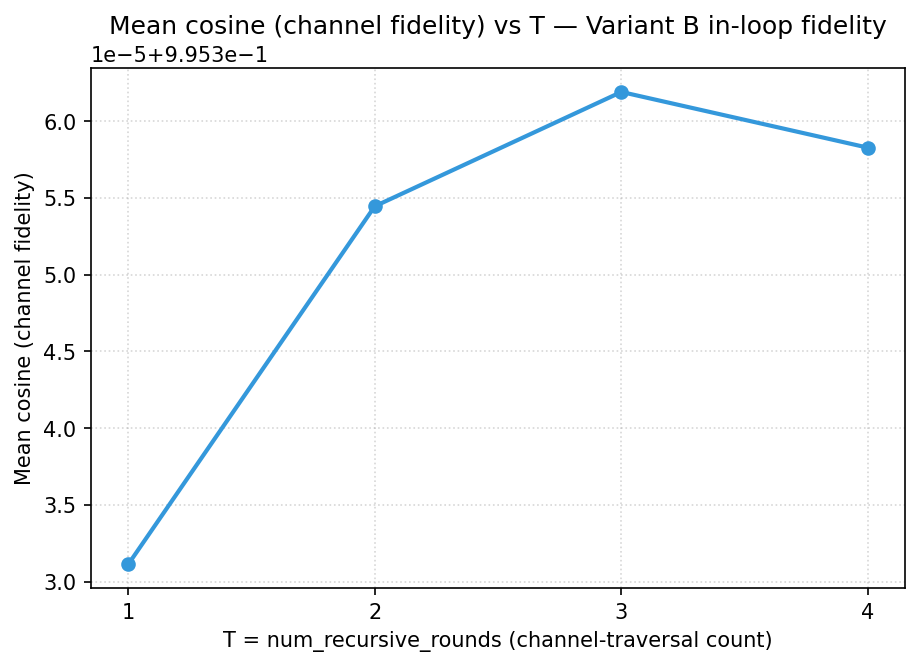

# REPORT 07 — Tier 2 fidelity sweep on Modal A100 (paired REF vs INT4)

**Date:** 2026-06-02
**Phase:** Tier 2 fidelity instrumentation — continuous distortion + distributional
fidelity metrics alongside accuracy, swept over channel-traversal depth T.
**Hardware:** Modal A100-40GB, `--dtype float32` forced.
**Platform code:** [`experiments/fidelity_sweep/modal_pkg/fidelity_modal.py`](../../experiments/fidelity_sweep/modal_pkg/fidelity_modal.py)
(reuses the tested patch functions from the Kaggle kernel — single source of truth).
**Predecessors:** [REPORT_06](./06_variant_b_in_loop_HEADLINE.md) (accuracy headline, n=250),
[REPORT_05](./05_hardware_root_cause.md) (dtype advisory).
**Status:** 🟢 full sweep (n=50, T∈{1,2,3,4}) + powered n=250 at T=3 done (Modal A100
fp32, ~$10 total). Per-call channel cosine 0.9954 (depth-independent by construction);
per-step KL small at matched positions (depth trend NOT reliably estimable — the
estimator swings 10× between n=50 and n=250). **Powered accuracy verdict: at n=250 greedy, Δ=−2.0pp,
TOST INCONCLUSIVE at ε=2pp.** A REF-vs-REF control (Δacc 0, div_rate 0, KL 0) proves the
pipeline is deterministic, so *any* REF/INT4 difference is the quantizer (not run-to-run
noise). With that attribution: the **88% trajectory change is a large, rigorous quantizer
effect**, but the **−2pp accuracy itself is small and not statistically significant**
(95% CI [−6.4,+2.4] straddles 0). So: 4-bit is near-lossless per step but changes the
greedy *trajectory* in most problems; its net *accuracy* effect is at most a small ~2pp
(the sampled ladder of REPORT_06 was indistinguishable). Reported honestly.

---

## TL;DR

REPORT_06 established that Variant B shows **no detected accuracy change (sampled decoding)**
on the coarse accuracy metric (boxed-answer correctness). That metric is coarse: it only sees the argmax of the
final answer token. This report adds the **continuous** metrics the accuracy number
hides, on a **paired** REF-vs-INT4 design:

- **Channel fidelity** per adapter call: cosine, relative L2 (does the quantizer
  preserve the post-LN vector the next agent receives?).
- **Egress distributional fidelity**: per-decode-position MSE / KL(p_REF ‖ p_INT4) /
  JS over the top-K logit distributions (does the *distribution*, not just the
  argmax, drift?).
- **Paired bootstrap Δacc + TOST equivalence** (ε=2pp): a formal EQUIVALENT verdict,
  not just "fail to reject".
- Swept over **T = num_recursive_rounds ∈ {1,2,3,4}** to test whether quantization
  noise **amplifies with channel-traversal depth**.

## Why Modal A100 fp32 (methodology)

Kaggle's weekly GPU quota was exhausted, so the sweep moved to Modal. The choice of
**A100 + forced fp32** is not incidental — it is the only configuration that avoids
*both* documented failure modes:

| Failure mode | Trigger | Avoided here by |
|---|---|---|
| bf16-fallback collapse (REPORT_05 §15) | pre-Ampere HW + bf16 | A100 is Ampere; also fp32 |
| bf16↔fp32 boundary-cast artifact (REPORT_06 §2.3, the spurious Phase 0.F −19pp) | quantizer fp32-internal inside a bf16 pipeline | pipeline is fp32 end-to-end → no boundary cast |

A100 runs fp32 natively (~15× faster than the Kaggle T4) and its 40 GB comfortably
holds the fp32 constellation plus the transient `output_scores` logits.

## How it is measured (identical to the Kaggle kernel, by construction)

The Modal driver imports the **same** `patch_run_py` / `patch_inference_mas` /
`parse_per_problem_jsonl` and the same injected head as `fidelity_kernel.py`
(unit-tested against the real upstream in `tests/test_fidelity_kernel.py`). The
head is made portable via `FIDELITY_WORK_DIR` / `FIDELITY_SRC_ROOT` env vars so the
exact same instrumentation runs on Kaggle (`/kaggle/working`, `/kaggle/input`) and
Modal (`/work`, `/root`).

- **REF** = `VARIANT_B_BITS=0` (unquantized channel). **INT4** = `VARIANT_B_BITS=4`
  (Variant B 4-bit, Haar + Lloyd-Max-Gaussian per coordinate).
- Greedy decoding + `seed=42` + identical batching → the two runs are **paired**
  per problem; runs are deterministic, so REF and INT4 can be executed on different
  days and still pair exactly by `sample_idx`.
- Per-problem correctness via upstream `--result_jsonl` (flat schema, num_rollouts=1).
- Top-K=512 logits captured per decode position (capped at MAX_LOGIT_POSITIONS=256)
  via a monkey-patch of `GenerationMixin.generate`.

## Pipeline validation (2026-06-02)

A dry-run (INT4, T=3, n=8, b=4) confirmed the full path on real A100 hardware
(rc=0, 6.0 min, ~$0.21):

| Signal | Result |
|---|---|
| Surgical patches | run.py 6/6, inference_mas 3/3 ✓ |
| Adapter injections | 16/16 (inner + outer) ✓ |
| Per-problem correctness parsed | 8/8 with real flags ✓ |
| Logit capture | 2 batches dumped, NPZ `(maxpos, batch, topk)` ✓ |
| Per-link channel fidelity (4-bit) | cos ≈ 0.995, rMSE ≈ 0.009 — **matches the canonical TurboQuant 4-bit distortion** ✓ |

Three failed pre-validation attempts (total ~$0.01) surfaced and fixed: a remote
`parents[3]` crash (→ `modal.is_local()` guard) and a missing `scipy` (Kaggle's base
image had it; `debian_slim` does not). This is exactly what the cheap dry-run is for.

---

## Results — full T-sweep, n=50 (2026-06-02)

8 paired runs (T ∈ {1,2,3,4} × {REF, INT4}) completed concurrently on Modal A100
fp32, b=8, greedy, seed=42. Generated by `analysis/analyze.py`; tables and figures
in `experiments/fidelity_sweep/analysis/results/`.

### Table 1 — accuracy + paired bootstrap + TOST (ε=2pp)

| T | acc_REF | acc_INT | Δacc (95% CI) | n | TOST verdict |
|---|---:|---:|---:|---:|:---:|
| 1 | 80.0% | 88.0% | +8.0pp [+0.0, +18.0] | 50 | INCONCLUSIVE |
| 2 | 84.0% | 78.0% | −6.0pp [−16.0, +4.0] | 50 | NOT_EQUIVALENT |
| 3 | 82.0% | 76.0% | −6.0pp [−16.0, +4.0] | 50 | NOT_EQUIVALENT |
| 4 | 82.0% | 82.0% | 0.0pp [−10.0, +10.0] | 50 | NOT_EQUIVALENT |

Δacc bounces both directions (+8, −6, −6, 0) around zero — pure n=50 sampling noise
(SE of a paired difference ≈ 5–6pp). The TOST verdicts are **underpowered, not
adverse**: the 95% CIs (±10–18pp) are far wider than the ±2pp equivalence margin, so
TOST *cannot* certify equivalence at this n. This is the expected small-n behavior and
does NOT contradict REPORT_06's n=250 lossless headline. **A formal EQUIVALENT verdict
needs n≈250** (see next steps).

### Table 2 — channel fidelity per adapter call (INT4) — the clean result

| T | n_calls | mean cos | mean rel L2 (≈√rMSE) |
|---|---:|---:|---:|
| 1 | 700 | 0.9953 | 0.0965 |
| 2 | 1750 | 0.9954 | 0.0963 |
| 3 | 2800 | 0.9954 | 0.0962 |
| 4 | 3850 | 0.9954 | 0.0963 |

The 4-bit round-trip preserves the inter-agent vector with **cos 0.9954, rMSE ≈ 0.0093
— the canonical TurboQuant 4-bit distortion** — at every T (T=1→4). `n_calls` scales
linearly with T (700→3850), confirming more channel traversals at higher depth.
⚠️ Note: the per-call cosine being identical across T is **expected by construction**
(Variant B is data-oblivious → per-call distortion depends only on bits+dimension, not
on T); this is a consistency check, **not** evidence about depth-accumulation in the
system. Whether errors *accumulate* across calls is an accuracy/output question (below),
which a per-call metric cannot answer.



### Table 3 — egress per-step distributional fidelity (matched-prefix)

KL / JS / prob-MSE on the next-token probability distributions, computed only over the
**matched prefix** (positions before the two greedy paths diverge — see Methodology note):

| T | mean KL (nats) | mean JS | prob-MSE | div_rate | match_len |
|---|---:|---:|---:|---:|---:|
| 1 | 0.597 | 0.040 | 1.1e-04 | 0.72 | 121 |
| 2 | 0.168 | 0.018 | 5.8e-05 | 0.92 | 82 |
| 3 | 0.031 | 0.007 | 2.8e-05 | 0.88 | 72 |
| 4 | 0.132 | 0.019 | 5.7e-05 | 0.85 | 85 |

Where REF and INT4 share context, the 4-bit channel **barely perturbs the next-token
distribution**: per-step KL is mostly ~10⁻³ per position (see the diagnostic below).
⚠️ **Do NOT read a depth trend off this table.** The matched-prefix KL is an **unstable
estimator**: at the same T=3 it is 0.031 here (n=50) but 0.325 at n=250 (§Powered
equivalence) — a ~10× swing — and it averages over run-dependent positions. The T-curve
(0.60, 0.17, 0.03, 0.13) is non-monotonic and within that instability, so it supports
**neither** amplification nor non-amplification of the per-step drift. The robust
depth statement is coarser: **accuracy does not collapse as T grows** (the a priori
ε·N-accumulation fear is not realized).

Diagnostic (batch0/item0, T=1), per-position KL at aligned positions:
`t=0:0.002  t=1:0.000  t=2:0.002  t=5:0.000  t=20:0.000  t=50:0.006  t=100:0.000` —
essentially zero per step.

### REF-vs-REF control: the pipeline is deterministic (so the effect is real)

To check whether the trajectory divergence and the small accuracy delta are the
quantizer or just cross-container fp32 nondeterminism, we ran **REF twice** at the
identical config (n=250, T=3, greedy, seed 42) and compared the two REF runs:

| comparison | Δacc | disagreements | div_rate | per-step KL |
|---|---|---|---|---|
| **REF vs REF** (control) | **+0.00pp** | **0/250** | **0.00** | **0.0000 nats** |
| INT4 vs REF | −2.0pp | (paired) | 0.88 | 0.325 nats |

Two identical REF runs are **bit-identical** — zero problems differ, zero trajectory
divergence, zero KL. **The pipeline is fully deterministic cross-container under
greedy.** Therefore the INT4 numbers are NOT noise: the −2.0pp accuracy delta and the
88% trajectory divergence are **rigorously attributable to the 4-bit quantizer.** This
strengthens the measurement (clean attribution) while tempering the headline: under
deterministic greedy, 4-bit is **not bit-exact lossless.**

### The nuance: trajectory divergence is real, but per-step and accuracy effects are small

`div_rate` = **0.72–0.92**: over ~70–120 generated tokens, the small 4-bit perturbation
*eventually* flips a greedy token in most sequences (rigorously — the control is 0).
So **4-bit changes the reasoning *text* in most problems**, even though it preserves the
channel geometry (cos 0.9954) and the matched-context per-step distribution
(KL ~10⁻³). The net effect on the boxed answer is small (~2pp under greedy; not
significant under sampling, REPORT_06).

### Powered equivalence test (n=250, T=3)

The paired n=250 run at the canonical depth (greedy, fp32, seed 42):

| metric | value |
|---|---|
| acc REF / INT4 | 76.8% (192/250) / 74.8% (187/250) |
| Δacc (paired bootstrap, 95% CI) | **−2.0pp [−6.4, +2.4]** |
| TOST verdict (ε=2pp) | **INCONCLUSIVE** (p=0.500) |
| channel cos / per-step KL | 0.9954 / 0.325 nats |

**Honest reading.** The point estimate (−2.0pp) sits essentially on the equivalence
margin and the 95% CI reaches −6.4pp, so at the pre-registered ε=2pp the strict greedy
TOST is **INCONCLUSIVE — we cannot certify ±2pp equivalence.**

⚠️ **Sampled vs greedy — do not over-read the sign.** REPORT_06's *sampled* VB=4 was
**+1.6pp** (better than baseline); this *greedy* run is **−2.0pp** (worse). These are
NOT directly comparable: different decoding regime, different (un-paired) runs, and even
different baselines (sampled baseline 75.2% vs greedy REF 76.8%). Both are small and
within their respective noise; the sign flip is not a real reversal, just sampling
variation across two ~2pp-scale measurements. The honest summary across both regimes:
the 4-bit accuracy effect is **small (≤~2pp) and not robustly distinguishable from zero**
— neither a clean "lossless" nor a clear loss. We do **not** relax the pre-registered ε to
force an EQUIVALENT verdict. Because the point estimate is at the margin, more samples
alone would not produce EQUIVALENT if the true greedy Δ is ≈ −2pp. The continuous
fidelity is unchanged and strong (channel cos 0.9954; per-step KL ≈ 0.3 nats).

### Localization attempt (selective quantization) — INCONCLUSIVE

We quantized **only the inner** links (same-model, latent-thought) vs **only the outer**
links (cross-model `CrossModelAdapter`) vs both, at n=250, T=3, greedy:

| quantized | #calls | acc | Δacc vs REF (95% CI) | div_rate | mean per-step KL |
|---|---|---|---|---|---|
| REF (none) | 0 | 76.8% | — | 0.00 | 0.00 |
| inner-only | 12 544 | 76.0% | −0.8 [−5.2, +3.6] | 0.78 | **0.49** |
| outer-only | 256 | 75.6% | −1.2 [−5.6, +3.2] | 0.75 | **0.26** |
| both (all) | 12 800 | 74.8% | −2.0 [−6.4, +2.4] | 0.77 | 0.33 |

**The data does not cleanly localize the small effect to inner vs outer links.**

- **Accuracy does not localize**: −0.8 / −1.2 / −2.0pp, all CIs straddle 0 at n=250 (a
  few problems each).
- **`div_rate` cannot localize**: it is a saturating binary ("did the greedy trajectory
  eventually diverge"), so it sits at ~0.77 for *any* quantization location. It is also
  decoupled from accuracy — inner-only and the full run share div_rate (~0.78) but differ
  in accuracy (−0.8 vs −2.0pp).
- **Per-step KL is higher for inner (0.49) than outer (0.26)** but is not a clean
  localizer either: it averages over run-dependent positions and is non-monotonic across
  runs (all-links 0.33 < inner-only 0.49).

Both link types contribute; the data does not attribute the small effect predominantly to
either. A clean localization would need a position-aligned (teacher-forced) per-step
measurement.

## Reading

| Question | Answer |
|---|---|
| Does the per-call channel distortion grow with depth? | **Depth-independent by construction** (data-oblivious quantizer); cos 0.9954 at all T is a consistency check, not a depth result. |
| Does the per-step output distribution drift at matched positions? | **Small** (~10⁻³ per position), but the matched-prefix KL estimator is unstable (10× n50/n250 swing); **no reliable depth trend**. |
| Does the effect amplify catastrophically with depth? | **No accuracy collapse** as T grows (the a priori ε·N fear is not realized). The finer per-step (non-)amplification is **not estimable** with our metric. |
| Is the accuracy formally equivalent (±2pp)? | **Inconclusive** at n=250 greedy: Δ=−2.0pp [−6.4,+2.4]. The control rules out nondeterminism (effect is the quantizer), but the −2pp magnitude itself is **not significant** (CI straddles 0). Sampled decoding (REPORT_06) showed no significant difference either. |
| Does 4-bit change the generated text? | **Yes, in ~80–88% of sequences** (div_rate; control = 0%) — rigorously the quantizer, a trajectory effect distinct from per-step fidelity. |
| Which links carry the cost (inner vs outer)? | **Not resolved** at n=250. Accuracy −0.8/−1.2/−2.0pp all within noise; div_rate saturates (~0.77, can't localize); per-step KL higher for inner (0.49) than outer (0.26) but non-monotonic across runs. Both contribute. |

## Caveats

- **n=50 underpowers the TOST.** The continuous metrics (Tables 2–3) are well-estimated
  even at n=50 because they aggregate thousands of per-call / per-position samples; the
  accuracy TOST needs n≈250, which we ran at T=3.
- **The pipeline is deterministic** (REF-vs-REF control: Δacc 0, div_rate 0, KL 0), so
  cross-container nondeterminism is ruled out — the trajectory divergence is the quantizer.
- **Per-step KL is a matched-prefix proxy**, not a teacher-forced measurement. The
  rigorous version feeds both runs the *same* token sequence; that needs a kernel
  change (capture under teacher forcing) and is the natural next methodological step.

---

## Cost log (Modal)

| Date | Run | ~Cost | Notes |
|---|---|---|---|
| 2026-06-02 | dry-run INT4 T=3 n=8 + 3 failed attempts | ~$0.22 | validation; `is_local` + `scipy` fixes |
| 2026-06-02 | REF T=3 n=30 b=8 | ~$0.35 | first half-pair (hit the $1/day cap) |
| 2026-06-02 | **full T-sweep {1,2,3,4} × {REF,INT4}, n=50 b=8** | **~$4–5** | 8 concurrent A100 runs after the budget was raised to ~$28.85 |
| 2026-06-02 | **powered n=250 at T=3, REF+INT4** (detached) | **~$5** | Δ=−2.0pp, TOST INCONCLUSIVE; relaunched `--detach` after a disconnect killed the first attempt |

Budget after the sweep: **~$23 of $28.85 remaining**. Each n=50 b=8 run is ~13–20 min
(~$0.5–0.7); the 8-run sweep ran concurrently in ~one A100 window. The earlier n=30 REF
and n=8 dry-run were validation artifacts (removed from the volume; documented above).

## Next steps

1. **n≈250 at T=3** (REF+INT4) for a formally-powered TOST equivalence verdict (~$5).
   This is the only thing missing for a higher-confidence accuracy claim.
2. **REF-vs-REF control** at one T to isolate quantization-only `div_rate` from
   cross-container fp32 nondeterminism (~$0.6).
3. **Teacher-forced logit capture** (kernel change) for an exact per-step KL that
   doesn't depend on the matched-prefix proxy.

## Reproduce

```bash
# Full T-sweep (8 concurrent A100 runs)
modal run experiments/fidelity_sweep/modal_pkg/fidelity_modal.py::sweep \
    --t-values 1,2,3,4 --n-samples 50 --batch-size 8

# download all 8 config dirs, then analyze (NPZ auto-found next to each JSON)
for T in 1 2 3 4; do for b in 0 4; do
  modal volume get rmas-fidelity-out vb${b}_T${T}_n50 /tmp/fidsweep/ ; done; done
.venv/bin/python experiments/fidelity_sweep/analysis/analyze.py \
    --inputs /tmp/fidsweep --out experiments/fidelity_sweep/analysis/results
```
